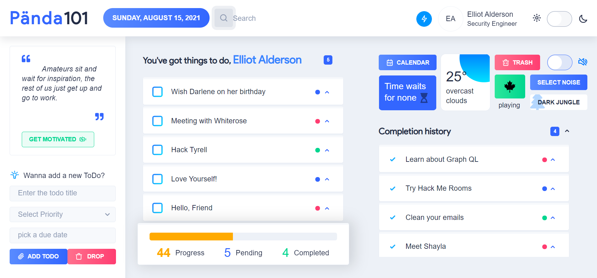
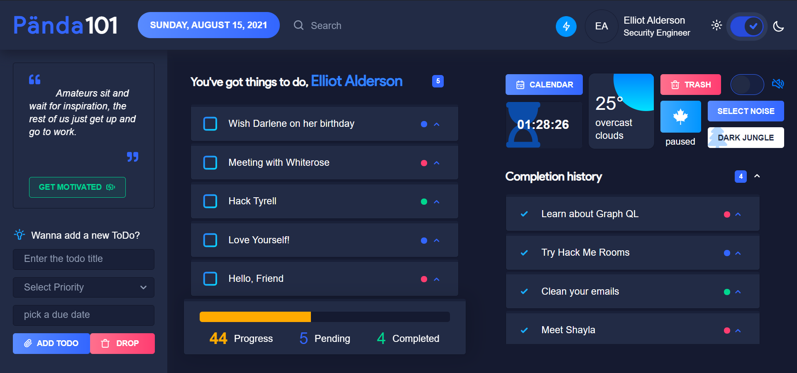
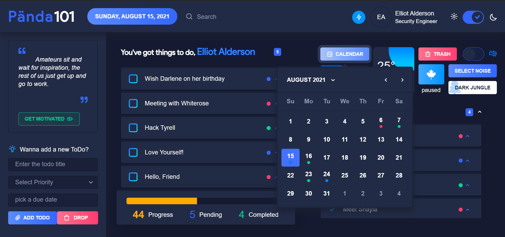
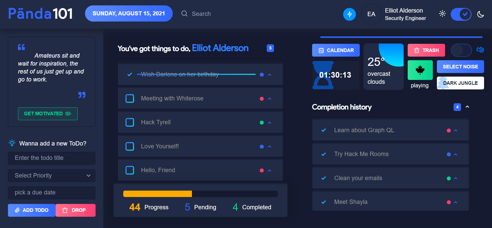
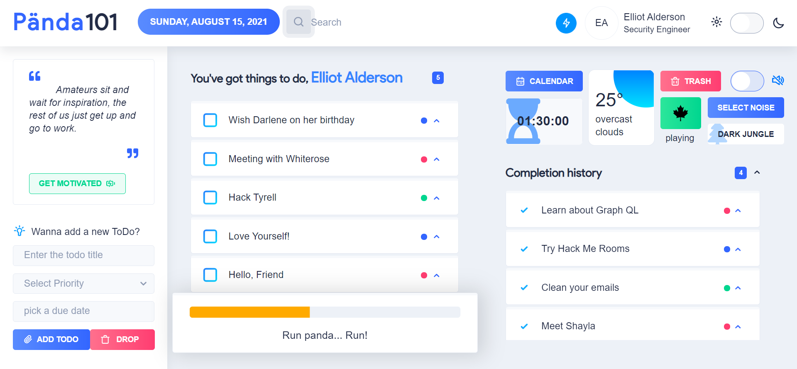
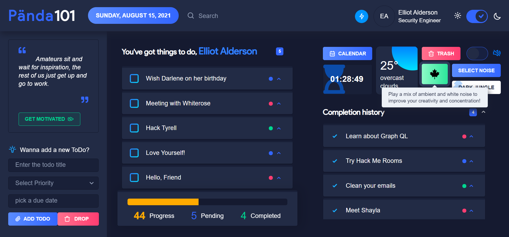
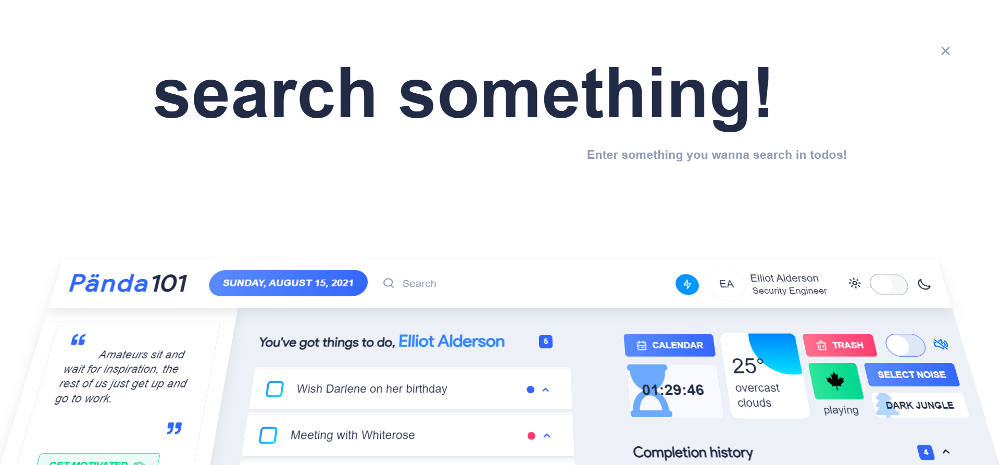
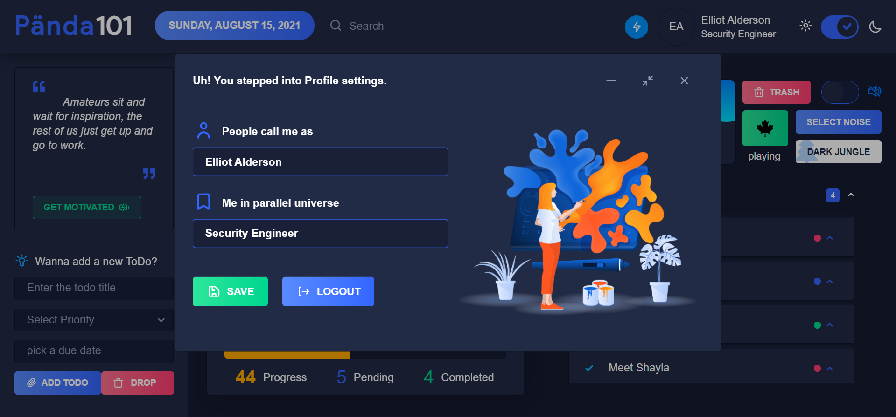
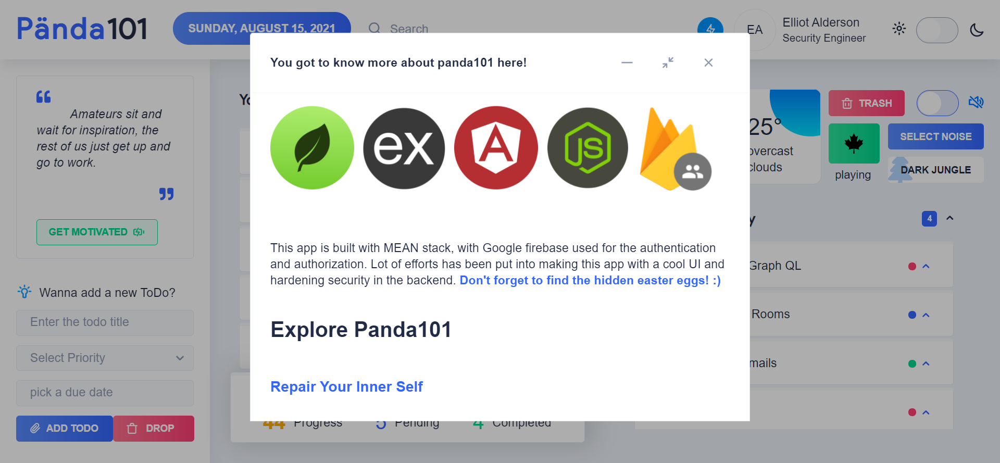

# panda101-todoapp

I was searching for a todo app, that has everything from creating todos with dates to having a whitenoise player that makes me relax. Well, one would not just demand whitenoise in a todo app, unless he's obssessed with it :). So, I designed my own todo app, in angular with nebular UI library to make it more awesome interms of UI.

you can find my app live, on [panda101](https://panda101todo.web.app).

## Note:
The app requires authentic email ID to send user, the verification link. Kindly, don't get annoyed by the username and password character restrictions! :) Happy Productive time...

## No nitty-gritty BS tech details, but just screenshots!

